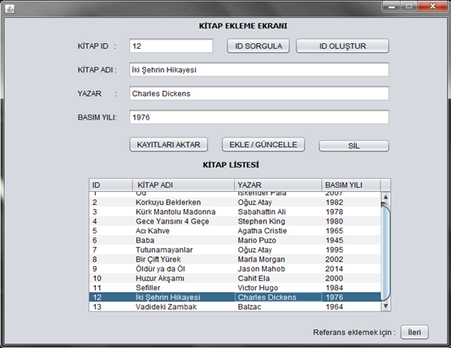
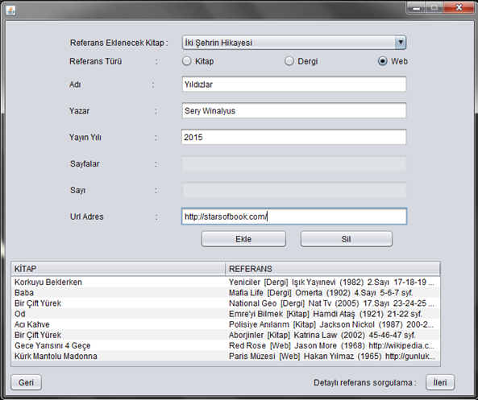
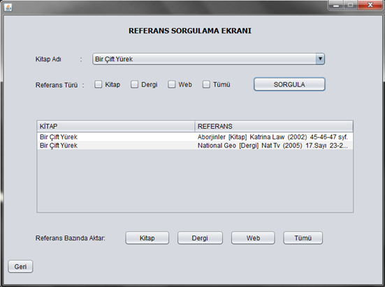
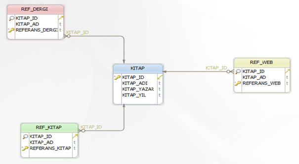

# Book Reference Management

Java desktop application (NetBeans) for tracking the references of books. Books are registered with their details, references of different types — book, journal, web — are attached to them, and everything can be queried from a single screen. Data access uses JDBC and entity beans over a relational database. The UI is in Turkish.

**Adding a book** — entries go to the database and appear in the table at the same time.

**Adding a reference** — references are saved per type and listed in the grid.

**Querying** — a book's references can be filtered by one or more reference types, or queried in bulk.

Deleting a book removes its records from all screens at once.

